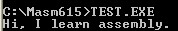
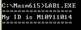

## 1 組合語言(Assembly Language)是甚麼？

* 一種電腦語言
* 所有中高階語言(C、JAVA、BASIC...)之程式，都須經由 **組合語言** 轉變成執行檔

## 2 開發環境


只需與80x86相容的機器都可以.



* 作業系統：DOS
* 組譯器：MASM6.15
* 連結器：使用MASM6.15內附的LINK>EXE
* 文書處理器：附檔名為 `*.asm`


## 3 範例


印出 Hi, I learn assembly.




```nasm
.model small
.data
mes	db	"Hi, I learn assembly.$"

.stack
.code
main proc
	mov ax,@data
	mov ds,ax

	mov dx,offset mes
	mov ah,09h
	int 21h		

	mov ax,4c00h
	int 21h
main endp
end main
```

## 4 作業


1. 印出自己的學號
2. 使用特殊符號包圍住




```nasm
.model small
.data
mes1	db	'==================',0ah,0dh,'$'
mes2	db	'My ID is M10911014',0ah,0dh,'$'
mes3	db	'==================',0ah,0dh,'$'

.stack
.code
main proc
	mov ax,@data
	mov ds,ax

	mov dx,offset mes1
	mov ah,09h
	int 21h	
	
	mov dx,offset mes2
	mov ah,09h
	int 21h	

	mov dx,offset mes3
	mov ah,09h
	int 21h	

	mov ax,4c00h
	int 21h
main endp
end main
```